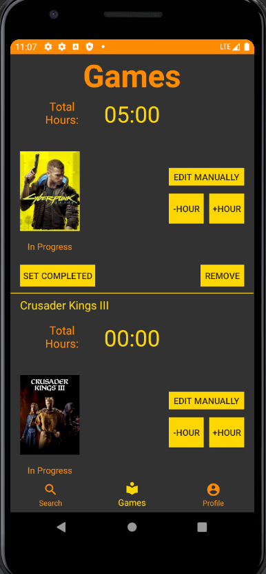

# Mobile-App-Development-Game-Tracker
---

## Third Year Mobile App Development Courserwork
This is a game tracking application made in Android Studio which is using **IMDB API**

Various Features of the App:
 
 - Search Games using IMDB API
 - Add Games to your library
 - Library represents a ROOM SQLite Database
 - Android SharedPreferences are used to store small user data
 - Fireabase Authentication is used for Login/Register system
 - User can edit his profile picture

## Game Library View
---

